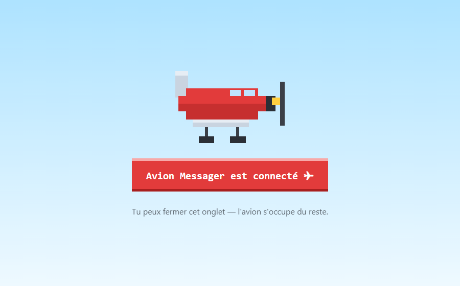

# ✈️ Avion Messager

[](https://github.com/pamasse/avion-messager-rs/actions/workflows/ci.yml)

> Un avion pixel art traverse ton écran en tirant une banderole avec ta prochaine
> réunion Google Agenda — quelques minutes avant qu'elle ne commence.


L'overlay est **transparent et laisse passer les clics** : il n'interrompt jamais le
travail. L'application vit dans la barre système, sans fenêtre résidente.

Réimplémentation **native Windows** (Rust + Win32, sans WebView ni runtime JS) du
projet [avion-messager](https://github.com/pamasse/avion-messager) (Tauri v2) :
un binaire unique de **2,8 Mo**, ~2 Mo de mémoire privée au repos, zéro processus enfant.

## Fonctionnalités

- 🛩️ **Rappel automatique** : l'avion passe *N* min avant chaque réunion (2/5/10/15/30 min)
- 🖱️ **Clic gauche** sur l'icône tray : l'avion passe avec la prochaine réunion
- 📅 **Menu** (clic droit) : les 5 prochaines réunions — celles avec visio sont
  **cliquables** et ouvrent le Meet
- ⏸️ **Pause** et mode **« pas d'avion pendant une réunion »** (pour les partages d'écran)
- 🖥️ **Multi-écrans** : l'avion vole sur l'écran où se trouve le curseur
- 🔔 **Icône vivante** : badge rouge quand une réunion commence dans ≤ 5 min ;
  l'info-bulle affiche la prochaine réunion
- 🚀 Démarrage automatique avec la session (builds release)

## Installation

### Via l'installateur MSI (recommandé)

Installation **par utilisateur**, sans droits admin : exe dans
`%LOCALAPPDATA%\Programs\Avion Messager\` + raccourci menu Démarrer.
Désinstallation via « Applications installées ».

Prérequis de build (une fois) :

```powershell
dotnet tool install --global wix --version 5.0.2
wix extension add -g WixToolset.Util.wixext/5.0.2
```

```powershell
cargo build --release
wix build wix/main.wxs -ext WixToolset.Util.wixext -o target/wix/AvionMessager.msi
```

Pas de mise à jour automatique (choix assumé) : « Rechercher des mises à jour »
compare la version au dernier tag GitHub et ouvre la page de release s'il y a plus
récent ; installer le nouveau MSI remplace l'ancien (l'app qui tourne est fermée
proprement, puis relancée).

**Build interne** (distribuer à une équipe sans que chacun crée son client OAuth) :
placer `client_config.json` à la racine du repo (git-ignoré), puis :

```powershell
wix build wix/main.wxs -ext WixToolset.Util.wixext -d IncludeClientConfig -o target/wix/AvionMessager-interne.msi
```

Cette variante dépose aussi les identifiants dans `%APPDATA%\com.pierre.avionmessager\`
(fichier *permanent* : il survit aux mises à niveau et à la désinstallation).
⚠️ Ne **jamais** publier ce MSI-là : il contient le `client_secret`. Le MSI public
n'embarque que l'exe.

### Depuis les sources

```powershell
cargo build --release   # → target\release\avion-messager.exe (2,8 Mo)
```

## Configuration Google OAuth — `client_config.json`

L'application a besoin d'un client OAuth **« Application de bureau »** (scope
`calendar.readonly`, lecture seule). Créer un fichier JSON **plat** — pas le JSON
téléchargé par Google, qui enveloppe sous `"installed"` :

```json
{ "client_id": "…apps.googleusercontent.com", "client_secret": "GOCSPX-…" }
```

Ordre de recherche (spec §4.10) :

1. `%APPDATA%\com.pierre.avionmessager\client_config.json` (app installée)
2. `.\client_config.json`
3. `..\client_config.json`

Sans ce fichier, l'app affiche une erreur claire et quitte. À la connexion, le
navigateur s'ouvre pour le consentement, puis :



Le refresh token est stocké dans le **trousseau Windows** de la session (jamais
dans un fichier), et aucun jeton n'est journalisé.

## Réglages — `settings.json`

`%APPDATA%\com.pierre.avionmessager\settings.json`, piloté depuis le menu tray
(rétrocompatible : un champ absent prend sa valeur par défaut) :

| Champ | Défaut | Rôle |
|---|---|---|
| `lead_minutes` | `2` | délai avant la réunion pour déclencher l'avion |
| `paused` | `false` | coupe le tir automatique (le manuel reste actif) |
| `suppress_during_meeting` | `true` | pas de tir automatique pendant une réunion en cours |
| `autostart` | `true` | démarrage avec Windows (release uniquement) |

## Performance

Mesures Windows 11, build release (`opt-level="z"`, `lto`, `strip`) :

| Mesure | Valeur |
|---|---|
| Binaire | **2,80 Mo** |
| Mémoire privée au repos | **1,75 Mo** |
| Working set au repos (pages DLL système partagées incluses) | 23 Mo |
| Processus enfants | aucun |

Le vol lui-même est quasi gratuit : le visuel est composé **une seule fois**
(`UpdateLayeredWindow`), l'animation ne fait que déplacer la fenêtre.

## Développement

```powershell
cargo test                 # logique pure (48 tests, horloge injectée partout)
cargo test -- --ignored    # + test du trousseau (touche le Credential Manager)
cargo run -- --fly "Texte" # joue un seul vol avec ce texte, puis quitte
```

La spécification fonctionnelle de référence (règles métier normatives §4) vit dans
le dépôt frère : [`avion-messager/docs/SPECIFICATION.md`](https://github.com/pamasse/avion-messager/blob/main/docs/SPECIFICATION.md).
Écarts assumés de cette version : réunions cliquables (lien Meet), vol sur l'écran
du curseur, clic gauche = vol manuel, fenêtre overlay à la taille du visuel,
délai par défaut 2 min (spec : 10).

## Licence

[MIT](LICENSE)
